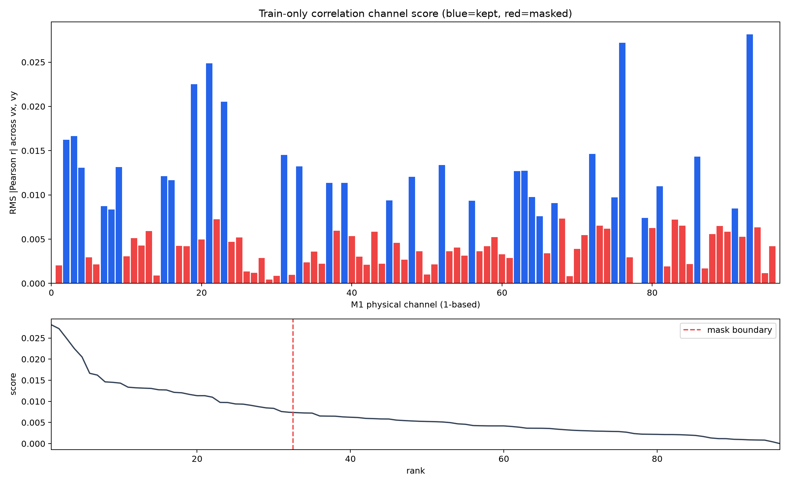
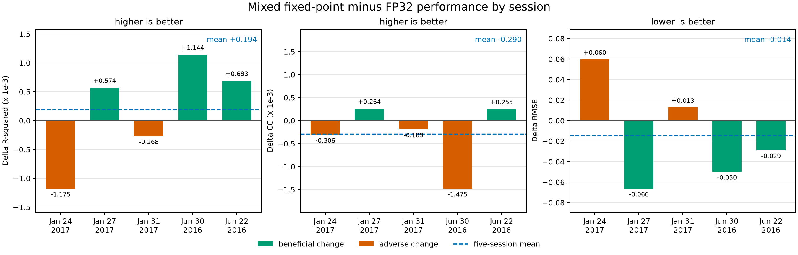
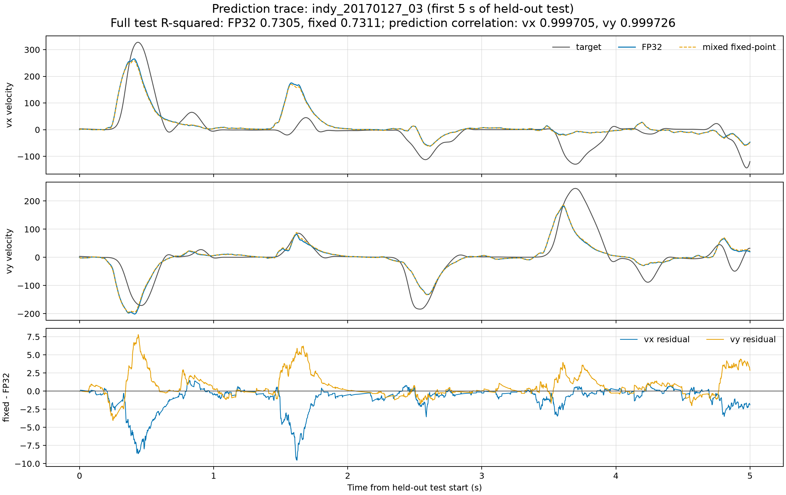

# Shared results

이 폴더에는 GitHub에서 바로 확인할 수 있는 소형 결과표, 대표 artifact와 그림만
포함합니다. 모델 checkpoint, 전체 prediction, 원본 데이터와 중간 log는
`outputs/`에 유지하며 Git에는 포함하지 않습니다.

## 포함 자료

- [`summary.csv`](summary.csv): 5개 세션의 96/64/32채널 최종 지표
- [`fixed_point_summary.csv`](fixed_point_summary.csv): FP32와 mixed fixed-point의
  세션별 R², CC, RMSE 및 saturation 요약
- [`fixed_point_prediction_agreement.csv`](fixed_point_prediction_agreement.csv):
  두 구현의 예측값 차이와 축별 상관계수
- [`fixed_point_layer_quantization.csv`](fixed_point_layer_quantization.csv):
  세션·layer별 scale, 양자화 오차와 saturation 진단
- `figures/`: channel ranking 및 fixed-point 결과 그림
- `sample/`: 대표 top-32 run의 protocol·결과 artifact

## Channel selection 결과

Channel ranking은 각 세션의 chronological training 구간에서만 계산했습니다.
따라서 아래 결과는 같은 세션의 held-out test 구간에서 평가한 within-session
결과이며, 과거 세션에서 고정한 mask의 cross-session 평가는 아닙니다.

| 채널 수 | 평균 test R² | 평균 test CC | 96채널 대비 평균 ΔR² |
|---:|---:|---:|---:|
| 96 | 0.6970 | 0.8383 | 0.0000 |
| 64 | 0.6870 | 0.8314 | -0.0100 |
| 32 | 0.6380 | 0.8016 | -0.0589 |



## Mixed fixed-point 결과

96채널 FP32 checkpoint 5개를 입력 1-bit event, weight 8-bit, decay 13-bit,
membrane potential 32-bit 조건으로 변환했습니다. 각 checkpoint의 원래 FP32
결과를 현재 코드로 다시 평가했으며 저장된 baseline 수치와 모든 지표가
`1e-12` 이내에서 일치했습니다.



| 세션 | FP32 R² | Fixed R² | ΔR² | ΔCC | ΔRMSE |
|---|---:|---:|---:|---:|---:|
| indy_20170124_01 | 0.742061 | 0.740886 | -0.001175 | -0.000306 | +0.059697 |
| indy_20170127_03 | 0.730525 | 0.731099 | +0.000574 | +0.000264 | -0.066129 |
| indy_20170131_02 | 0.710082 | 0.709815 | -0.000268 | -0.000189 | +0.012869 |
| indy_20160630_01 | 0.585506 | 0.586650 | +0.001144 | -0.001475 | -0.049778 |
| indy_20160622_01 | 0.716591 | 0.717283 | +0.000693 | +0.000255 | -0.028777 |
| **5세션 평균** | **0.696953** | **0.697146** | **+0.000194** | **-0.000290** | **-0.014424** |

### 해석

- 총 625,831개 held-out test timestep을 평가했습니다.
- 최대 절대 변화는 R² 0.001175, CC 0.001475, RMSE 0.066129입니다. 즉, 이
  설정에서는 FP32 성능이 사실상 유지됐습니다.
- R²는 3/5세션에서 증가하고 2/5세션에서 감소했습니다. CC와 RMSE의 방향도
  세션별로 섞여 있으므로, 평균의 작은 개선을 양자화에 의한 성능 향상으로
  주장하지 않습니다.
- 5세션·4개 layer 전체에서 weight, decay, threshold와 membrane potential
  saturation은 모두 0회였습니다.
- FP32와 fixed-point 예측의 축별 상관계수 범위는 vx 0.998227–0.999833,
  vy 0.998596–0.999823입니다.

아래 그림은 기존 channel-selection 대표 세션과 같은 `indy_20170127_03`의
held-out test 시작 후 첫 5초를 사용합니다. 구간을 결과에 맞춰 선별하지 않았으며,
위 두 panel에서 FP32와 fixed-point 예측이 거의 겹치기 때문에 마지막 panel에
두 예측의 잔차를 따로 표시했습니다.



Python 정수 emulation은 hardware accelerator가 아니므로 실행시간을 FPGA
latency나 전력 효율로 해석하지 않습니다. 또한 논문에 공개되지 않은 layer scale과
Q-format 선택이 포함되어 있어 bit-exact FPGA 재현 결과도 아닙니다. 상세 가정은
[`MIXED_FIXED_POINT_BASELINE.md`](../docs/MIXED_FIXED_POINT_BASELINE.md)에
정리되어 있습니다.

## 결과 다시 내보내기

전체 fixed-point 실행이 완료된 상태에서 다음 명령을 실행하면 이 폴더의 세 CSV와
두 fixed-point 그림을 `outputs/`의 원본 결과로부터 다시 생성합니다.

```powershell
uv run python scripts/generate_result_figures.py
```
