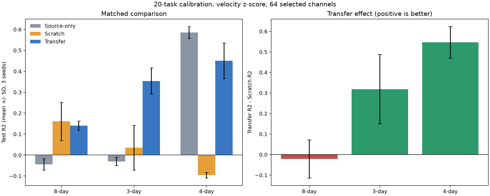
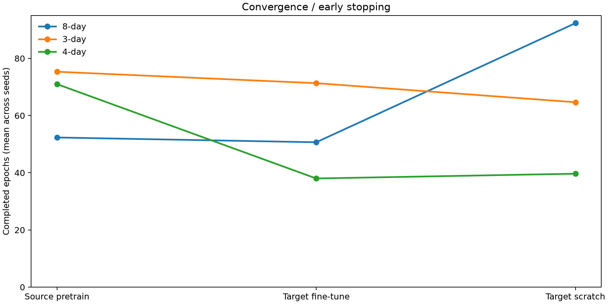

# 전이학습 효과 검증: 20-task 정규화 3-seed 실험

## 한 줄 결론

3개 세션 쌍과 3개 seed에서 `Transfer - Scratch`의 평균 R2 차이는 **0.281 ± 0.037**였습니다. 총 9번의 직접 비교 중 전이학습이 Scratch보다 높은 R2를 낸 횟수는 **7/9**입니다. 양수이면 전이학습 이득, 음수이면 negative transfer입니다.

## 핵심 결과

아래 값은 test R2의 `평균 ± 표준편차`(seed 42, 43, 44)입니다.

| 세션 간격 | Source-only | Scratch | Transfer | Transfer - Scratch | Transfer 승리 |
|---|---:|---:|---:|---:|---:|
| 8-day | -0.044 ± 0.028 | 0.161 ± 0.092 | 0.140 ± 0.022 | -0.021 ± 0.093 | 1/3 |
| 3-day | -0.030 ± 0.020 | 0.035 ± 0.106 | 0.354 ± 0.062 | 0.319 ± 0.169 | 3/3 |
| 4-day | 0.585 ± 0.029 | -0.096 ± 0.014 | 0.451 ± 0.085 | 0.547 ± 0.077 | 3/3 |

- **Scratch**: 목표 세션 calibration 데이터만으로 처음부터 학습
- **Transfer**: source 세션에서 미리 학습한 뒤 같은 목표 calibration 데이터로 미세조정
- 두 방법의 목표 데이터, 채널, seed, epoch 상한, learning rate, early stopping 규칙은 동일합니다.
- 그러므로 가장 중요한 비교는 `Transfer - Scratch`입니다. Source-only와 기존 96/64채널 결과는 보조 설명용입니다.

## 실험 조건

- 대상: 8일, 3일, 4일 차이의 primary 세션 쌍 3개
- 반복: seed 42, 43, 44
- 채널: 논문의 안정성 + 중요도 - 중복도 방식으로 96개 중 64개 선택
- 목표 calibration: 20 task 중 16개 학습, 4개 검증(약 60 reaches)
- 속도 정규화: source는 source train만, target은 target calibration 20개만 사용한 축별 z-score
- 평가지표: 원래 속도 단위로 복원한 R2, CC, RMSE
- 최대 epoch: source/transfer/scratch 모두 100, patience 10
- 테스트: 시간상 뒤쪽의 완전 분리된 연속 구간, 상태는 시작 시 한 번만 초기화
- 208일 stress pair는 primary 결론에서 제외했습니다.

## 기존 실험과의 참고 비교

이 값들은 동일한 직접 대조군이 아니므로 효과 판정에는 사용하지 않습니다.

| 세션 간격 | 기존 96채널 R2 | 기존 within-session 64채널 R2 |
|---|---:|---:|
| 8-day | 0.586 | 0.597 |
| 3-day | 0.731 | 0.708 |
| 4-day | 0.710 | 0.681 |

## 유효성 점검

- 데이터 누수: **없도록 설계됨**. 채널 선택과 target 정규화에는 calibration 20개까지만 사용했고 target validation/test는 제외했습니다.
- 공정한 대조: Transfer와 Scratch는 동일 seed, 동일 calibration, 동일 test span 및 동일 학습 조건을 사용합니다.
- seed 분리: 출력 폴더를 seed별로 나눠 checkpoint가 섞이지 않습니다.
- 채널 선택 안정성: seed 간 mask Jaccard가 모두 1인지 확인한 결과 **통과**입니다. 선택 알고리즘 자체에는 난수가 없습니다.
- 수렴: 27개 stage 중 25개가 100 epoch 전에 종료되었습니다. 자세한 값은 `convergence.csv`와 아래 그림에 있습니다.

## 해석할 때의 한계

- seed가 3개뿐이므로 표준편차는 볼 수 있지만 강한 통계적 유의성 결론에는 부족합니다.
- 세션 쌍도 3개뿐이므로 다른 동물·날짜에 일반화된다고 단정할 수 없습니다.
- calibration을 10개에서 20개로 늘린 효과와 속도 정규화 효과가 함께 바뀌었습니다. 둘을 따로 분리하려면 이후 ablation이 필요합니다.
- 기존 96채널 및 within-session 64채널은 학습 데이터 양과 프로토콜이 달라 직접적인 전이학습 효과 대조군이 아닙니다.

## 생성 파일

- `raw_metrics.csv`: 모든 seed·pair·방법의 R2/CC/RMSE
- `metric_summary.csv`: pair·방법별 평균과 표준편차
- `transfer_effects_per_seed.csv`: seed별 Transfer - Scratch
- `transfer_effect_summary.csv`: pair별 전이 효과 평균·표준편차와 승리 횟수
- `convergence.csv`: best/completed epoch와 early stopping 여부
- `channel_stability.csv`: seed 간 선택 채널 Jaccard

프로토콜 기준 seed는 42이며, 각 seed 폴더의 protocol에는 해당 seed가 별도로 기록되어 있습니다.
